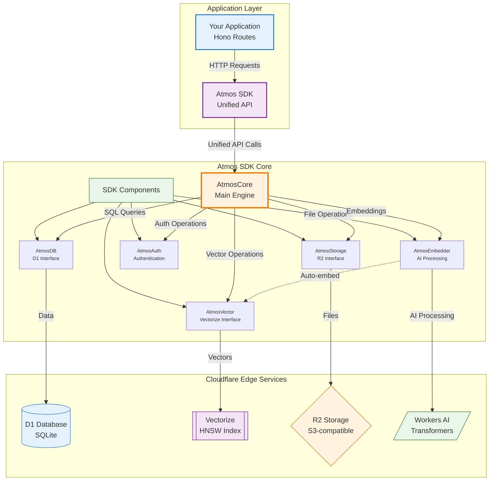

# AtmosDB — Supabase for the Edge

[](https://badge.fury.io/js/atmos-sdk)
[](https://opensource.org/licenses/Apache-2.0)

**AtmosDB** is a unified SDK-driven backend framework designed exclusively for Cloudflare Workers. It abstracts Cloudflare D1 (SQL), Vectorize (semantic search), and R2 (storage) into a single, developer-friendly interface, bringing the "Supabase" experience strictly to the Edge.

## Architecture & Services Flow

AtmosDB follows a layered architecture design, providing a unified interface to Cloudflare's edge services through a clean, modular SDK structure.



### Architecture Layers

| Layer | Purpose | Components |
|-------|---------|------------|
| **Application Layer** | Your app logic | Hono routes, business logic |
| **SDK Core Layer** | Unified interfaces | AtmosDB, AtmosVector, AtmosStorage, AtmosAuth, AtmosEmbedder |
| **Service Layer** | Cloudflare services | D1 Database, Vectorize, R2 Storage, Workers AI |

### Data Flow Patterns

- **CRUD Operations**: `HTTP Request → AtmosDB → D1 Database → Response`
- **Semantic Search**: `Text Input → AtmosEmbedder → Workers AI → Vectorize → Results`
- **File Storage**: `File Upload → AtmosStorage → R2 Bucket → File URL`
- **Authentication**: `Login Request → AtmosAuth → JWT Token → Protected Routes`

### Core Services:
* **D1 (Relational Store)**: Handled by `AtmosDB`. Provides blazing-fast edge CRUD operations without leaving the worker environment.
* **Vectorize (Semantic Store)**: Handled by `AtmosVector`. Seamlessly linked with D1 data for semantic lookups. 
* **Workers AI (Auto-Embed)**: Handled by `AtmosEmbedder`. Automatically parses row inputs into searchable vectors.
* **R2 (Storage)**: Handled by `AtmosStorage`. Serves as reliable edge file storage.

## ⚠️ Current Limitations

### Analytics Feature
The analytics functionality (DuckDB integration) is **not available** in Cloudflare Workers due to Web Worker API restrictions. The analytics example endpoints return appropriate error messages. For analytics capabilities, consider using:
- Separate Node.js services
- Serverless functions on other platforms
- Client-side analytics with DuckDB WASM

## Why AtmosDB
* **Zero Egress**: Run everything on Cloudflare's edge, eliminating costly cross-region or cross-cloud data transfers.
* **Edge-Native**: Purpose-built for Cloudflare Workers. It brings D1, R2, Vectorize and Workers AI under one roof.
* **AI-Native Space**: Auto-embedding support out of the box, allowing simple `.search()` calls over unstructured string data.

## Quickstart

```typescript
import { Atmos } from 'atmos-sdk'
import { Hono } from 'hono'

// Inject the bindings
const app = new Hono<{ Bindings: { DB: any, VECTORIZE: any, AI: any, BUCKET: any } }>()

app.post('/seed', async (c) => {
  const db = new Atmos({ 
    bindings: c.env, 
    ctx: c.executionCtx, // <--- ZERO LATENCY background embeddings!
    options: { autoEmbed: true } 
  })
  await db.set('users', { name: 'PYE', bio: 'Building things.' })
  return c.text('Seeded!')
})
```

## Auto-Embed Magic

With `autoEmbed: true`, Atmos seamlessly extracts your string fields, asks Workers AI for embeddings, saves vectors, and manages your structured data. 

```typescript
const semanticMatches = await db.search('users', 'people who construct objects')
// Returns 'Aarav'
```
## Documentation

Explore the comprehensive documentation for each module:

- [Getting Started](docs/getting-started.md)
- [Architecture Overview](docs/architecture.md)
- [Architecture FAQ & Scaling](docs/faq.md)
- [Database Operations (D1)](docs/database.md)
- [Semantic Search (Vectorize)](docs/vector-search.md)
- [Storage (R2)](docs/storage.md)
- [Authentication & Security](docs/authentication.md)
- [Middleware & Rate Limiting](docs/middleware.md)
- [Error Handling](docs/error-handling.md)

## API Reference
* `atmos.set(table, data)`: Insert to D1 (+ Vectorize if autoEmbed=true).
* `atmos.get(table, id)`: Retrieve from D1.
* `atmos.search(table, query)`: Embed query, search semantic matches, pull raw D1 records.
* `atmos.remove(table, id)`: Purge from both DB and Vectors.
* `atmos.store`: Proxy for R2 storage APIs.

* `atmos.auth`: JWT validation logic.

## Cloudflare Setup

To start properly you need these configured locally and on CF dashboard:
```bash
wrangler d1 create atmos-local
wrangler vectorize create atmos-vectors --dimensions=768 --metric=cosine
wrangler r2 bucket create atmos-storage
```

### Database Initialization
Before using `atmos.set()`, you must initialize your tables. AtmosDB provides a simple migration helper:

```typescript
const atmos = new Atmos({ bindings: env });
const migrations = new AtmosMigrations(atmos.db);
await migrations.up(['users', 'posts', 'products']);
```

## Current State & Roadmap
*   **v0.1.0**: Unified CRUD, Auto-Embeddings, Semantic Search, KV-based Rate Limiting, JWT & CF Access Auth.
*   **v0.2 (Roadmap)**: CLI tool (`atmos init`, `atmos deploy`), built-in Schema validation (Zod).
*   **Future Ideas**: Edge Analytics (Serverless DuckDB/Parquet integration, currently unsupported due to Workers API limitations).

## Author & Contact

**Created by Pavan Yellathakota**
* Email: pavan.yellathakota.ds@gmail.com
* LinkedIn: https://www.linkedin.com/in/yellatp

## License
Released under the [Apache 2.0 License](./LICENSE).
