# AtmosDB Architecture

AtmosDB follows a layered architecture design, providing a unified interface to Cloudflare's edge services through a clean, modular SDK structure.



## Architecture Layers

### 1. Application Layer
- **Your Application**: Built with Hono web framework
- **HTTP Routes**: RESTful endpoints for your API
- **Atmos SDK**: Unified interface to all Cloudflare services

### 2. SDK Core Layer
- **AtmosDB**: D1 database operations (SQL queries, CRUD)
- **AtmosVector**: Vectorize semantic search (vector similarity, embeddings)
- **AtmosStorage**: R2 file operations (upload/download, binary data)
- **AtmosAuth**: Authentication and security (JWT, sessions)
- **AtmosEmbedder**: AI-powered text embeddings (Workers AI integration)

### 3. Cloudflare Services Layer
- **D1**: Serverless SQLite database
- **Vectorize**: High-performance vector search with HNSW indexing
- **R2**: S3-compatible object storage
- **Workers AI**: Machine learning inference with Transformers

## Data Flow Patterns

### Standard CRUD Operations
```
HTTP Request → Hono Route → AtmosDB → D1 Database → Response
```

### Semantic Search with Auto-embedding
```
Text Input → AtmosEmbedder → Workers AI → Vectorize Index → Search Results
```

### File Storage Operations
```
File Upload → AtmosStorage → R2 Bucket → File URL/Response
```

### Authentication Flow
```
Login Request → AtmosAuth → JWT Token → Protected Routes
```

## Key Design Principles

### 1. **Unified API**
Single `Atmos` class provides consistent interface regardless of underlying service complexity.

### 2. **Edge-Native**
All operations happen within Cloudflare's edge network, eliminating cross-region latency.

### 3. **Type Safety**
Full TypeScript support with comprehensive type definitions.

### 4. **Modular Components**
Each service has its own specialized module, allowing selective usage.

### 5. **Auto-embedding**
Seamless integration between data storage and semantic search through automatic vector generation.

## Component Relationships

- **AtmosDB ↔ AtmosVector**: Data stored in D1 can be automatically vectorized for semantic search
- **AtmosEmbedder ↔ AtmosVector**: AI-generated embeddings feed directly into vector search
- **AtmosStorage ↔ All Components**: File storage complements all data operations
- **AtmosAuth ↔ All Components**: Security layer protects all operations

This architecture ensures AtmosDB remains lightweight, focused, and easy to extend while providing the full power of Cloudflare's edge computing platform.
